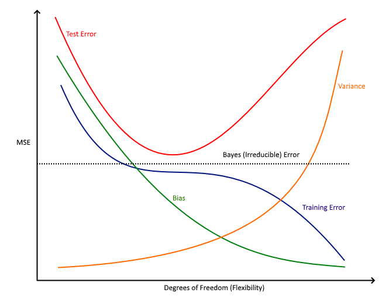

# Conceptual

1. For each of parts (a) through (d), indicate whether we would generally expect the performance of a flexible statistical learning method to be better or worse than an inflexible method. Justify your answer.

    (a) The sample size n is extremely large, and the number of predictors p is small.

        ```
        n being large provides us with a better representation of the model.
        p being small limits the amount of variance as there are only a few predictors.
        
        Based on these 2 facts, a flexible method will fare better than an inflexible approach.
        
        ```
        
    (b) The number of predictors p is extremely large, and the number of observations n is small.
    
        ```
        n is small implies there is not enough data to train the model with leading to overfitting with a 
        flexible method.
        p being large increases the amount of variance within the model due to the large number of predictors.
        
        Based on this, a flexible approach will fare worse than an inflexible method.
        
        ```

    (c) The relationship between the predictors and response is highly non-linear.
    
        ```
        A non-linear relationship implies more degrees of freedom which suits a flexible approach.
        
        Linear relationships, on the other hand, generally suit non-flexible methods.
        
        ```
        
    (d) The variance of the error terms, i.e. $\sigma^2$ = Var($\epsilon$), is extremely high.
    
        ```
        As there is high variance of the error terms, there is a lot of noise in the data. 
        
        This leads to a flexible method faring much worse as it tries to adapt to the noise.
        
        ```
        
2. Explain whether each scenario is a classification or regression problem, and indicate whether we are most interested in inference or prediction. Finally, provide n and p.


    (a) We collect a set of data on the top 500 firms in the US. For each firm we record profit, number of employees, industry and the CEO salary. We are interested in understanding which factors affect CEO salary.
    
        ```
        Classification/Regression: Regression
        Inference/Prediction: Inference (what factors affect the CEO salary)
        n: 500
        p: 3 (profit, number of employees, industry)
        
        ```

    (b) We are considering launching a new product and wish to know whether it will be a success or a failure. We collect data on 20 similar products that were previously launched. For each product we have recorded whether it was a success or failure, price charged for the product, marketing budget, competition price, and ten other variables.
    
        ```
        Classification/Regression: Classification
        Inference/Prediction: Prediction (is the product a success or failure)
        n: 20
        p: 13 (price charged for product, marketing budget, competition price, and 10 other variables)
        
        ```
    
    (c) We are interested in predicting the % change in the USD/Euro exchange rate in relation to the weekly changes in the world stock markets. Hence we collect weekly data for all of 2012. For each week we record the % change in the USD/Euro, the % change in the US market, the % change in the British market, and the % change in the German market.

        ```
        Classification/Regression: Regression
        Inference/Prediction: Prediction (% change in the USD/Euro exchange rate)
        n: 52 (weeks in 2012)
        p: 3 (% change in the US market, % change in the British market, and % change in the German market)
        
        ```
    

3. We now revisit the bias-variance decomposition. 

    (a) Provide a sketch of typical (squared) bias, variance, training error, test error, and Bayes (or irreducible) error curves, on a single plot, as we go from less flexible statistical learning methods towards more flexible approaches. The x-axis should represent the amount of flexibility in the method, and the y-axis should represent the values for each curve. There should be five curves. Make sure to label each one.
    
        

    (b) Explain why each of the five curves has the shape displayed in part (a).
    
        ```
        All 5 curves or lines have a Mean Squared Error (MSE) > 0.
        
        BIAS - decreases monotonically as with increases in flexibility, a closer fit is obtained.
        
        VARIANCE - increases monotonically as with increases in flexibility, overfitting occurs.
        
        TRAINING ERROR - Always decreases with flexibility.  Overfitting results in a lower MSE with training
        data.
        
        TEST ERROR - Shows the interaction between BIAS and VARIANCE.  First decreases as BIAS decreases and 
        VARIANCE is low.  Then increases with VARIANCE.
        
        BAYES (IRREDUCIBLE) ERROR - Defines the lower limit.  The TEST ERROR is bounded below by the 
        IRREDUCIBLE ERROR due to variance in the error (epsilon) in the output values (0 <= value). When the 
        TRAINING ERROR is lower than the IRREDUCIBLE ERROR, overfitting takes place.  The BAYES ERROR RATE is
        defined for classification problems and is determined by the ratio of data points which lie at the 
        "wrong" side of the decision boundary, (0 <= value < 1).
        
        ```
        
4. You will now think of some real-life applications for statistical learning.

    (a) Describe three real-life applications in which classification might be useful. Describe the response, as well as the predictors. Is the goal of each application inference or prediction? Explain your answer.
    
        ```
        Direction of stock price. Prediction problem with predictors like the closing price for day - 1, 
        day - 2, etc., trading volume, closing price details of closest 2 competitors in the same industry.

        Why is a person sick or healthy? Inference problem with predictors like heart rate, blood pressure, 
        height, weight.

        Spam email or not. Prediction problem with predictors like word frequency, length of sentence, 
        spelling errors, word count.
        
        ```
    (b) Describe three real-life applications in which regression might be useful. Describe the response, as well as the predictors. Is the goal of each application inference or prediction? Explain your answer.
    
        ```
        House prices. Prediction problem with predictors like area, number of bedrooms, neighborhood, 
        school nearby.

        Salary of a CEO. Inference problem with predictors like age, experience, education, knowledge of 
        industry.

        Closing price of a stock. Prediction problem with predictors like the closing price for day - 1, 
        day - 2, etc., trading volume, closing price details of closest 2 competitors in the same industry.
      
        ```
        
    (c) Describe three real-life applications in which cluster analysis might be useful.
    
        ```
        Market segmentation using customer demographics.

        Movie recommendations based on viewing habits.

        Cancer Types based on DNA analysis.
        
        ```

5. What are the advantages and disadvantages of a very flexible (versus a less flexible) approach for regression or classification? Under what circumstances might a more flexible approach be preferred to a less flexible approach? When might a less flexible approach be preferred?

    ```
    A flexible approach makes fewer assumptions and provides a better fit to the data. However, the fact that 
    there are very few assumptions made makes the model harder to interpret. Also, it may be prone to 
    overfitting.

    A more flexible approach would be preferred to a less flexible approach when we are interested in prediction 
    and not the interpretability of the results.

    A less flexible approach would be preferred to a more flexible approach when we are interested in inference 
    and the interpretability of the results.

    ```
6. Describe the differences between a parametric and a non-parametric statistical learning approach. What are the advantages of a parametric approach to regression or classification (as opposed to a nonparametric approach)? What are its disadvantages?

    ```
    A parametric approach reduces the problem of estimating f down to one of estimating a set of parameters 
    because it assumes a form for f.

    A non-parametric approach does not assume a functional form for f and so requires a very large number of 
    observations to accurately estimate f.

    The advantages of a parametric approach to regression or classification are the simplifying of modeling f
    to a few parameters and not as many observations are required compared to a non-parametric approach.

    The disadvantages of a parametric approach to regression or classification are a potential to inaccurately
    estimate f if the form of f assumed is wrong or to overfit the observations if more flexible models are 
    used.
    
    ```
    
7. The table below provides a training data set containing six observations, three predictors, and one qualitative response variable.

    | Obs. | $X_1$ | $X_2$ | $X_3$ | Y       |
    |------|------:|------:|------:|:-------:|
    | 1    | 0     | 3     | 0     | Red     |
    | 2    | 2     | 0     | 0     | Red     |
    | 3    | 0     | 1     | 3     | Red     |
    | 4    | 0     | 1     | 2     | Green   |
    | 5    | −1    | 0     | 1     | Green   |
    | 6    | 1     | 1     | 1     | Red     |


    Suppose we wish to use this data set to make a prediction for Y when $X_1 = X_2 = X_3 = 0$ using K-nearest neighbors.

    (a) Compute the Euclidean distance between each observation and the test point,  $X_1 = X_2 = X_3 = 0$
    
    
        ```
        Euclidean Distance = sqrt(sum((x1 - t1)^2 + (x2 - t2)^2 + (x3 - t3)^2)

        ```
        
        | Obs. | $X_1$ | $X_2$ | $X_3$ | Y       | Distance(0,0,0) | 
        |------|------:|------:|------:|:-------:|----------------:|
        | 1    | 0     | 3     | 0     | Red     | 3.0             |  
        | 2    | 2     | 0     | 0     | Red     | 2.0             |
        | 3    | 0     | 1     | 3     | Red     | 3.2             |
        | 4    | 0     | 1     | 2     | Green   | 2.2             |
        | 5    | −1    | 0     | 1     | Green   | 1.4             |
        | 6    | 1     | 1     | 1     | Red     | 1.7             |
        
    
    (b) What is our prediction with K = 1? Why?
    
        ```
        When K = 1, Y = Green as the nearest neighbor is Obs. 5.
        
        ```
        
    (c) What is our prediction with K = 3? Why?

        ```
        When K = 3, the nearest neighbors are Obs. 5 (Green), 6 (Red) and 2 (Red).
        Hence, Y = Red for the test point (majority is red).
        
        ```

    (d) If the Bayes decision boundary in this problem is highly nonlinear, then would we expect the best value for K to be large or small? Why?
    
        ```
        If the Bayes decision boundary is non-linear, then K needs to be small in order to be flexible.
        
        If K is large, it takes more points into consideration making it more linear than flexible.
        
        ```

---

# Applied

### Problem 8

This exercise relates to the **College** data set, which can be found in the file **College.csv**. It contains a number of variables for 777 different universities and colleges in the US. The variables are

* **Private** : Public/private indicator
* **Apps** : Number of applications received
* **Accept** : Number of applicants accepted
* **Enroll** : Number of new students enrolled
* **Top10perc** : New students from top 10% of high school class
* **Top25perc** : New students from top 25% of high school class
* **F.Undergrad** : Number of full-time undergraduates
* **P.Undergrad** : Number of part-time undergraduates
* **Outstate** : Out-of-state tuition
* **Room.Board** : Room and board costs
* **Books** : Estimated book costs
* **Personal** : Estimated personal spending
* **PhD** : Percent of faculty with Ph.D.’s
* **Terminal** : Percent of faculty with terminal degree
* **S.F.Ratio** : Student/faculty ratio
* **perc.alumni** : Percent of alumni who donate
* **Expend** : Instructional expenditure per student
* **Grad.Rate** : Graduation rate
    
Before reading the data into R, it can be viewed in Excel or a text editor.

Use the **read.csv()** function to read the data into R. Call the loaded data college. Make sure that you have the directory set to the correct location for the data.
        
```{r}
college <- read.csv("data/college.csv")
#fix(college)

```
        
Look at the data using the **fix()** function. You should notice that the first column is just the name of each university. We don’t really want R to treat this as data. However, it may be handy to have these names for later. Try the following commands:
    
```{r}
rownames(college) <- college[, 1]
#fix(college)

```

You should see that there is now a **row.names** column with the name of each university recorded. This means that R has given each row a name corresponding to the appropriate university. R will not try to perform calculations on the row names. However, we still need to eliminate the first column in the data where the names are stored. Try

```{r}
college <- college[, -1]
#fix(college)

```

Now you should see that the first data column is **Private**. Note that another column labeled **row.names** now appears before the **Private** column. However, this is not a data column but rather the name that R is giving to each row.

Use the **summary()** function to produce a numerical summary of the variables in the data set.
    
```{r}
summary(college)

```

Use the **pairs()** function to produce a scatterplot matrix of the first ten columns or variables of the data. Recall that you can reference the first ten columns of a matrix A using A[,1:10].

```{r}
pairs(college[,1:10])

```

Use the **plot()** function to produce side-by-side boxplots of **Outstate** versus **Private**.

```{r}
plot(college$Private, college$Outstate, xlab = "Private", ylab = "Outstate")

```

Create a new qualitative variable, called **Elite**, by *binning* the **Top10perc** variable. We are going to divide universities into two groups based on whether or not the proportion of students coming from the top 10% of their high school classes exceeds 50%.

```{r}
Elite <- rep("No", nrow(college))
Elite[college$Top10perc > 50] <- "Yes"
Elite <- as.factor(Elite)
college <- data.frame(college, Elite)

```

Use the **summary()** function to see how many elite universities there are. Now use the **plot()** function to produce side-by-side boxplots of **Outstate** versus **Elite**.

```{r}
summary(college$Elite)

```

```{r}
plot(college$Elite, college$Outstate, xlab = "Elite", ylab = "Outstate")
```

Use the **hist()** function to produce some histograms with differing numbers of bins for a few of the quantitative variables. You may find the command **par(mfrow=c(2,2))** useful: it will divide the print window into four regions so that four plots can be made simultaneously. Modifying the arguments
to this function will divide the screen in other ways.

```{r}
hist(college$Outstate)
```

```{r}
par(mfrow = c(2, 2))
hist(college$Outstate, main = "Outstate")
hist(college$Enroll, main = "Enroll")
hist(college$Top25perc, main = "Top 25")
hist(college$Expend, main = "Expend")
```

Continue exploring the data, and provide a brief summary of what you discover.

### Problem 9

This exercise involves the **Auto** data set studied in the lab. Make sure that the missing values have been removed from the data.

```{r}
auto <- read.csv("data/Auto.csv", header = TRUE, na.strings = "?")
```

Which of the predictors are quantitative, and which are qualitative?

```{r}
summary(auto)
```


```{r}
str(auto)
```

```
Quantitative Predictors - mpg, displacement, horsepower, weight, acceleration
Qualitativve Predictors - cylinders, year, origin, name 
```

What is the range of each quantitative predictor? You can answer this using the **range()** function.

```{r}
sapply(auto[, -c(2, 7, 8, 9)], range, na.rm = TRUE)
```

What is the mean and standard deviation of each quantitative predictor?


```{r}
sapply(auto[, -c(2, 7, 8, 9)], mean, na.rm = TRUE)
```


```{r}
sapply(auto[, -c(2, 7, 8, 9)], sd, na.rm = TRUE)
```

Now remove the 10th through 85th observations. What is the range, mean, and standard deviation of each predictor in the subset of the data that remains?

```{r}
sapply(auto[-c(10:85), -c(2, 7, 8, 9)], range, na.rm = TRUE)
```

```{r}
sapply(auto[-c(10:85), -c(2, 7, 8, 9)], mean, na.rm = TRUE)
```

```{r}
sapply(auto[-c(10:85), -c(2, 7, 8, 9)], sd, na.rm = TRUE)
```

Using the full data set, investigate the predictors graphically, using scatterplots or other tools of your choice. Create some plots highlighting the relationships among the predictors. Comment on your findings.

```{r}
pairs(auto[, -c(2, 7, 8, 9)])
```

Suppose that we wish to predict gas mileage (**mpg**) on the basis of the other variables. Do your plots suggest that any of the other variables might be useful in predicting **mpg**? Justify your answer.

```{r}
plot(as.factor(auto$year), auto$mpg)
```

```{r}
plot(as.factor(auto$cylinders), auto$mpg)
```

```{r}
cor(auto[, -9], use = "pairwise.complete.obs")
```

### Problem 10

This exercise involves the **Boston** housing data set.

To begin, load in the **Boston** data set. The **Boston** data set is part of the **MASS** library in R.

```{r}
library(MASS)
```

Now the data set is contained in the object Boston.

```{r}
head(Boston)
```

Read about the data set:

```{r}
# ?Boston
```


How many rows are in this data set? How many columns? What do the rows and columns represent?

```{r}
dim(Boston)
```

```
Rows are the records in the Boston data set.
Columns are the fields or variables in the data set.
```

Make some pairwise scatterplots of the predictors (columns) in this data set. Describe your findings.

```{r}
par(mfrow = c(2, 2))
plot(Boston$nox, Boston$crim)
plot(Boston$rm, Boston$crim)
plot(Boston$age, Boston$crim)
plot(Boston$dis, Boston$crim)
```

```{r}
pairs(Boston)
```

Are any of the predictors associated with per capita crime rate? If so, explain the relationship.

```{r}
cor(Boston)
```

```
Positive per capita crime rate relationship with:

rad (index of accessibility to radial highways): 0.62550515
tax (full-value property-tax rate per $10,000): 0.58276431
lstat (lower status of the population - percent): 0.45562148
nox (nitrogen oxides concentration - parts per 10 million): 0.42097171
indus (proportion of non-retail business acres per town): 0.40658341
age (proportion of owner-occupied units built prior to 1940): 0.35273425
ptratio (pupil-teacher ratio by town): 0.28994558

Negative per capita crime rate relationship with:

medv (median value of owner-occupied homes in $1000s): -0.38830461
black (1000(Bk (0)63)^2 where Bk is the proportion of blacks by town): -0.38506394
dis (weighted mean of distances to five Boston employment centres): -0.37967009
rm (average number of rooms per dwelling): -0.21924670
zn (proportion of residential land zoned for lots over 25,000 sq. ft): -0.20046922
chas (Charles River dummy variable (= 1 if tract bounds river; 0 otherwise): -0.05589158
```

Do any of the suburbs of Boston appear to have particularly high crime rates? Tax rates? Pupil-teacher ratios? Comment on the range of each predictor.

```{r}
hist(Boston$crim[Boston$crim > 1], breaks = 25)
```

```{r}
nrow(Boston[Boston$crim > 20, ])
```
```
Most of the suburbs have low crime rates.  However, there is a long tail with 18 suburbs with a crime rate > 20
reaching to above 80
```

```{r}
hist(Boston$tax)
```

```{r}
summary(Boston$tax)
```

```
Tax rates are skewed to the left with most suburbs having a low tax rate and a peat around 650-700.
```

```{r}
hist(Boston$ptratio)
```

```{r}
summary(Boston$ptratio)
```

```
Pupil-teacher ratios are spread across with a negative skew.
```

How many of the suburbs in this data set bound the Charles river?

```{r}
table(Boston$chas)
```

What is the median pupil-teacher ratio among the towns in this data set?

```{r}
median(Boston$ptratio)
```

Which suburb of Boston has lowest median value of owneroccupied homes? What are the values of the other predictors for that suburb, and how do those values compare to the overall ranges for those predictors? Comment on your findings.

```{r}
Boston[Boston$medv == min(Boston$medv), ]
```

```{r}
sapply(Boston, quantile)
```

```
Compared to the overall ranges,
- age & rad of the lowest median value suburbs are at the max.
- crim, indus, nox, tax, ptratio, lstat are either at or above the 75th percentile.
- low for zn, rm, dis.
```

In this data set, how many of the suburbs average more than seven rooms per dwelling? More than eight rooms per dwelling? Comment on the suburbs that average more than eight rooms per dwelling.

```{r}
nrow(Boston[Boston$rm > 7, ])
```

```{r}
nrow(Boston[Boston$rm > 8, ])
```

```{r}
rbind(sapply(Boston[Boston$rm > 8,], mean), sapply(Boston, median))
```

```
- Crime rates are higher (almost 3x)
- higher proportion of 25k sq foot lots
- much lower lstat value
- higher medv value
```

